## 解析

骨头覆盖的变种题目

- https://github.com/zhuoyuan/HihoCoder/tree/master/1143%23Dominocoverage
- https://cloud.tencent.com/developer/article/1073557

核心是,怎么分类,先用脑暴 🧠,纸上画图





设$f(n)$ 表示长度为$n$的墙壁的方法数,显然有


$$
\begin{aligned}
f(n) &= f(n-1) + f(n-2) + 2f(n-3) + 2f(n-4) +\cdots +2f(0) \\
&= f(n-1) + f(n-2) + 2\times \sum_{i=0}^{n-3}f(i)

\end{aligned}
$$


具体看代码,但是可惜,我们这个代码会,超时,因为我们的代码是二重复循环,时间为$n^2$,而$n = 10^6,n^2 = 10^{12} > 10^8$

```cpp
<%- include("./rainboy.cpp") _%>
```

上面的程序超时,根据做题目的经验

1. 要么优化代码!!!!
2. 要么优化公式.

这里优化公式,发现

$$
\begin{aligned}
f(n) &= f(n-1) + f(n-2) + \boxed{ 2f(n-3) + 2f(n-4) +\cdots +2f(0)} \\
\end{aligned}
$$

这不就是前缀和吗!!!!! 😭😭😭😭😭😭😭

写代码啊!!


```cpp
<%- include("./rainboy2.cpp") _%>
```