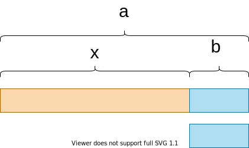

## 解析

求最长的满足条件的区间和的长度.

设$s_i$ 表示前$i$个元素的和

则

$$
(s_r - s_{l-1}) \mod 7 = 0 \\
(s_r \mod 7 - s_{l-1} \mod 7) \mod 7 = 0
$$


关键就在于如何理解上面的公式了!!


根据数论知识,则

$$
7 \mid a \land 7 \mid b \Rightarrow 7 \mid (a-b)
$$

但是这里的前提条件是$7 \mid (a -b)$ 成立,


$$
7 \mid (a-b) \Leftrightarrow a \mod 7 = b \mod 7 \tag 1
$$

也就是两都等价,这里只要证明式$(1)$成立就可以

根据带余除法,显然 $a \mod 7 = b \mod 7 \rightarrow (a-b) \mod 7 = 9$ 成立,只要证明$7 \mid (a-b) \rightarrow a \mod 7 = b \mod 7$ 成立

$7 \mid (a-b)$可以这样认为:有一个a木棍减去b木棍后,剩余的长度x是7的倍数




$$
\begin{aligned}
a \mod 7 &= (x+b) \mod 7 \\
& = (x \mod 7 + b \mod 7) \mod 7 \\
& = (b \mod 7 ) \mod 7 \\
& = b \mod 7
\end{aligned}
$$

证明完毕

得出结论

$$
7 \mid (a-b) \Leftrightarrow (a \mod 7) = (b \mod 7)
$$

模7的余数,只有7种,所有要使用桶来做

具体看代码

```cpp
<%- include("./rainboy.cpp") _%>
```


